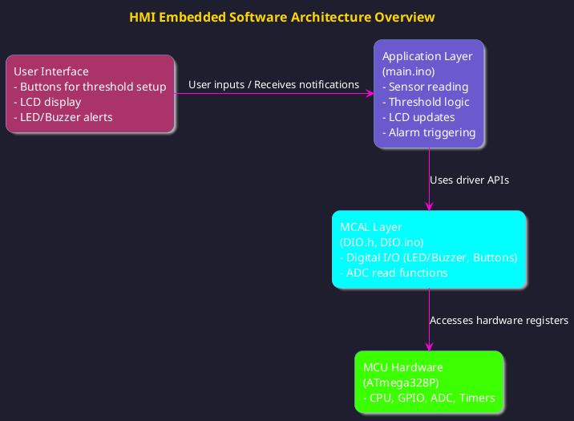
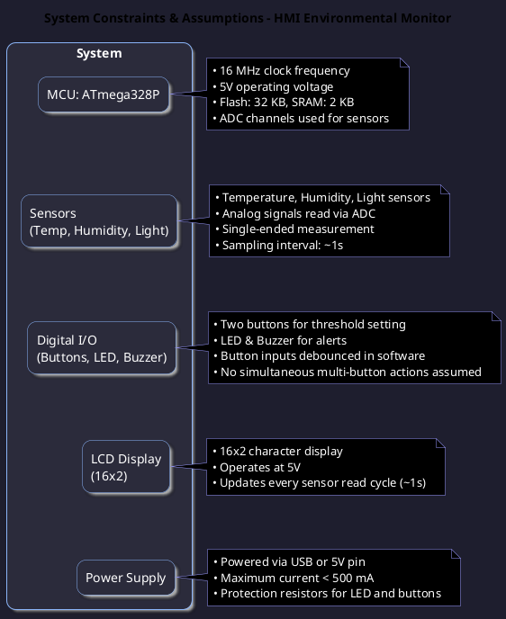
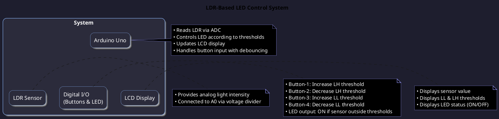
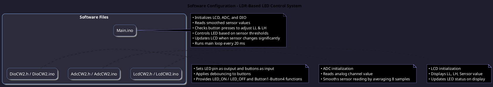
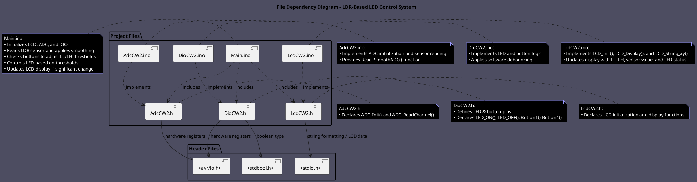

# LDR-Based LED Control System

| **Author(s)** | `Yousef Mohamed Mokhtar Hashem Ali (ID: 202500857), Ahmed Emad Ahmed Abdelmegeed (ID: 202300042)` |
| ------------- | ------------------------------------------------------------------------------------------------- |
| **Status**    | `Draft/Inspection/Approved`                                                                       |
| **Date**      | `14/11/2025`                                                                                      |

## Introduction

### Report Overview:

In embedded systems world, Human-Machine Interfaces (HMI) provide essential real-time feedback and control across various processes. When HMIs work effectively, users can view sensor readings, adjust system settings, and receive instantaneous notifications when something is out of the expected operating range. This system design project implements a small, microcontroller-based HMI capable of measuring temperature, humidity, and light intensity for monitoring.

The system operates using a microcontroller's analog-to-digital converters (ADC), an LCD with 16 columns and two rows for output, and two tactile buttons that allow users to set high and low thresholds. The HMI notifies the user with an LED or buzzer when any sensor readings exceed the given thresholds. This project effectively employs various systems design principles, including data acquisition in real-time, sensor reading integration, in-threshold/out-of-threshold logic for ease of use, user feedback, non-volatile memory for saved thresholds and states, and user notification in the expected system domain.

### Purpose

This report is a final accounting of the design, construction and testing of the HMI system. It covers the hardware components selection and integration (sensors, microcontroller, display, buttons, alarm) as well as embedded software hierarchies and logic from sensor read to threshold match to user input and alarm trigger.

In addition, more materials are provided in the appendices, including a BOM with a cheaper alternative, PlantUML diagrams of the system architecture and use case sequences, as well as Robot Framework test requirements for functionality. Finally, a video accompanies this report that shows live action from the final system integration. This report will provide understanding, replicability and full contextualization of the HMI system from design through implementation.

### Scope

The first use case for this project is a reliable and easy to operate HMI for environmental monitoring - users will have access to real-time temperature, humidity, and light readings to help keep proper conditions in a laboratory, greenhouse or anything that requires proper monitoring.

Users will also be able to set high and low thresholds for all three sensors with the inclusion of LED and buzzer feedback in real-time should any of the readings surpass those ranges. In addition to practical use, the secondary use case for this project is an educational experience to better understand embedded systems with applications of ADC interfacing, threshold application logic, real-time processing, user inputs and EEPROM storage. The design will be easy, cost effective and reliable for educational purposes as well as implementation.

## Architectural Overview

The context of the software architecture is as follows:

### Assumptions & Constraints

Indicate constraints of the low level design and any assumptions appropriate for the design.

## Functional Description

### Essential Componenet function :

* Button-1: Increases the high threshold (LH) by 10 units, up to a maximum of 1023.
* Button-2: Decreases the high threshold (LH) by 10 units, down to a minimum of 0.
* Button-3: Increases the low threshold (LL) by 10 units, up to a maximum of 1023.
* Button-4: Decreases the low threshold (LL) by 10 units, down to a minimum of 0.
* LED: Turns ON when the LDR sensor value is outside the defined limits (Sensor < LL or Sensor > LH) and OFF when the sensor is within the range.
* Arduino IDE: Platform used to write, compile, and upload the code to the Arduino Uno.
* Arduino Uno: Microcontroller board used to read the sensor, control the LED, and interface with the LCD and buttons.
* Liquid Cyrsatl Display (LCD): Displays the current sensor value, low limit (LL), high limit (LH), and LED status (ON/OFF).
* Resistors (pulldown & 330 Ω): Used to keep the button input HIGH when not pressed
* Resistors (pulldown & 10K Ω): Used to keep the button input HIGH when not pressed
* Potentiometer ( contrast control 10k Ω ): Adjusts the LCD contrast.

### How It Works :

(1) The system reads the LDR sensor through a smoothed ADC reading (average of 8 samples).

**(2) Threshold Control:**

* Pressing Button-1 or Button-2 adjusts the high limit (LH).
* Pressing Button-3 or Button-4 adjusts the low limit (LL).
* The limits are displayed on the second row of the LCD

**(3) LED control:**

* If the sensor value is within the limits, the LED turns OFF.
* If the sensor value is outside the limits (Sensor < LL or Sensor > LH), the LED turns ON.

**(4) LCD FeedBack:**

* The first row of the LCD shows the current LDR sensor value and the LED ALARM trigger status (ON/OFF).
* Any significant change in sensor value (Δ > 5) updates the LCD to prevent flickering.

**(5) Button Debouncing:**

* All button inputs include a 20 ms delay for debouncing to prevent false triggering.

**(6) User Interaction: :**

* Users can dynamically adjust the sensor limits using the buttons, and the system provides real-time visual feedback via the LCD and LED.

## Implementation of the Module

### Hardware Implementation

#### Components Needed

- **Arduino Uno** – Main controller.
- **LDR (Light Dependent Resistor)** – Measures ambient light intensity.
- **LED** – Indicates when the sensor value is outside the defined range.
- **16×2 LCD Display** – Shows sensor value, low limit (LL), high limit (LH), and LED status.
- **Push Buttons (4×)** – Adjust LL and LH thresholds.
- **Resistors:**
  - 10kΩ – Pull-up resistors for buttons.
  - 330Ω – Current-limiting resistor for LED.
- **Potentiometer (10kΩ)** – Controls LCD contrast.
- **Breadboard & Jumper Wires** – For connections.

#### Connections

**LDR Sensor**

- One end → 5V
- Other end → A0 (analog input) with 10kΩ resistor to GND (voltage divider).

**LED**

- Anode → PB5 (Digital Pin 13 on Arduino Uno) via 330Ω resistor
- Cathode → GND

**Buttons**

- Button-1 → PB4
- Button-2 → PB3
- Button-3 → PB2
- Button-4 → PB1
- Each button connects to GND; internal pull-ups enabled in code.

**LCD Display (16×2)**

- RS → PD0
- EN → PD1
- D4 → PD4
- D5 → PD5
- D6 → PD6
- D7 → PD7
- VSS → GND
- VDD → 5V
- V0 → Potentiometer middle pin (for contrast)
- RW → GND
- A/K (Backlight) → 5V/GND via 220Ω resistor

  

#### Working Principle

1. Arduino reads the **LDR value** from A0 and smooths the reading.
2. **Buttons** adjust the low (LL) and high (LH) thresholds.
3. **LED Control:**
   - Turns **ON** if LDR value < LL or > LH
   - Turns **OFF** if value is within range
4. **LCD Feedback:**
   - Displays sensor value, LL, LH, and LED status in real time.
5. **Debouncing:** Software handles button debouncing to prevent false triggering.

### Software Configuration

There are a total of **5 files** (including 2 header files) required for this program:

- **Main.ino** – The main file where the sequence of instructions is executed by the Arduino.
- **DioCW2.h / DioCW2.ino** – Header and C file for digital I/O, including buttons and LED functions.
- **AdcCW2.h / AdcCW2.ino** – Header and C file for ADC initialization and reading the LDR sensor.
- **LcdCW2.h / LcdCW2.ino** – Header and C file for LCD initialization and display functions.

#### Initialization

- **ADC Initialization:** Configure ADC with AVcc reference and prescaler 128.
- **DIO Initialization:** Set LED pin as output and button pins as input with pull-ups.
- **LCD Initialization:** Configure 16x2 LCD display, 4-bit mode, clear screen.

#### Main Loop Functionality

1. Continuously read the smoothed **LDR sensor value**.
2. Check **button presses** (Button1–Button4) to adjust **LL and LH thresholds**.
   - Apply **software debouncing** to ensure reliable input.
3. **LED Control:**
   - Turn **ON** if sensor < LL or > LH.
   - Turn **OFF** if sensor is within the range.
4. **LCD Update:**
   - Update display only if sensor value changes significantly (>5 units).
   - Show **LL, LH, sensor value, and LED status**.
5. Loop executes every **20 ms** to maintain responsiveness.

#### Functions Overview

- **DIO Functions:** `LED_ON()`, `LED_OFF()`, `Button1()–Button4()`
- **ADC Functions:** `ADC_Init()`, `ADC_ReadChannel()`
- **LCD Functions:** `LCD_Init()`, `LCD_Display()`, `LCD_String_xy()`
- **Utility:** `Read_SmoothADC()` for averaging 8 ADC samples.

## Integration And Configuration

The integration and configuration process of this LDR-based LED control system involves combining both the **hardware components** and the **software modules** to work seamlessly together on the Arduino Uno platform. This ensures that the sensor readings, button inputs, LED output, and LCD display function correctly in real-time.

#### Hardware-Software Integration

The **LDR sensor** is connected to the analog input (A0) of the Arduino Uno, providing light intensity readings that are processed by the ADC module in software. The **LED** is connected to a digital output pin, while the **four buttons** are connected to digital input pins with pull-up resistors, allowing for reliable threshold adjustments. The **LCD display** is connected using a 4-bit interface to show the sensor value, LL/LH thresholds, and LED status.

On the software side, the system consists of **Main.ino**, **DioCW2**, **AdcCW2**, and **LcdCW2** files. Each module has its own responsibilities: `DioCW2` handles digital input/output and button debouncing, `AdcCW2` manages sensor readings and smoothing, and `LcdCW2` controls the LCD display. The main loop in `Main.ino` orchestrates the flow by reading sensor values, checking buttons, controlling the LED, and updating the LCD.

#### Configuration Procedure

1. **Powering the System:** The Arduino is powered via USB or an external 5V source. Pull-up resistors ensure the buttons provide stable HIGH/LOW signals.
2. **Threshold Initialization:** The software initializes the **LL (lower limit)** and **LH (higher limit)** thresholds. These values can be adjusted dynamically through the buttons.
3. **Sensor Reading and Processing:** The ADC module continuously reads the LDR sensor values and applies smoothing by averaging multiple samples.
4. **Button Handling:** Button presses are debounced in software to prevent false triggers. Each button modifies the LL or LH threshold as programmed.
5. **LED and LCD Control:** Based on the sensor reading and the defined thresholds, the LED is turned ON or OFF. Simultaneously, the LCD is updated to reflect current sensor values, thresholds, and LED status.
6. **Timing and Responsiveness:** The main loop is executed with a short delay (20 ms), ensuring the system is responsive to user input while maintaining stable sensor readings.

Through this integration and configuration, the system ensures that **all hardware and software components interact correctly**, providing a robust and user-friendly interface for monitoring and controlling the LED based on light intensity.

#### ADC Module:

* Reads analog value from LDR sensor connected to A0.
* Smooths sensor reading by averaging 8 samples.
* Provides input for LED control and LCD display.

#### Digital I/O Module (DIO):

* PB5 configured as output (LED).
* PB1–PB4 configured as input (Buttons 1–4) with software debouncing.
  - Button1: Increase LH threshold
  - Button2: Decrease LH threshold
  - Button3: Increase LL threshold
  - Button4: Decrease LL threshold

#### Resistor Configuration:

* 330 Ω current-limiting resistor connected in series with LED.
* 10 kΩ pull-up resistors connected to button input pins.

#### LCD Display:

* 16x2 LCD configured in 4-bit mode.
* Displays current sensor value, LL and LH thresholds, and LED status (ON/OFF).

#### Power Supply:

* 5V from USB connection to the Arduino UNO.

#### System Operation:

The main loop continuously monitors the **LDR sensor** and **button inputs**.

- If the sensor value is outside the defined **LL–LH range**, the LED turns ON; otherwise, it remains OFF.
- Button presses adjust **LL and LH thresholds** dynamically.
- Any significant change in sensor reading updates the LCD display.
- LED and LCD are updated in real-time to reflect system state.

#### Verification:

Integration was verified by observing LED behavior and LCD display updates.
Button presses correctly adjusted LL and LH thresholds, and the LED responded to sensor readings as expected, confirming correct initialization and configuration of all modules.

### Static Files

Typically a module consists of C and H files but other file types may exist. List all files that form this module

| File name    | Contents                                                                                                                               |
| ------------ | -------------------------------------------------------------------------------------------------------------------------------------- |
| `Main.ino`   | Main program file containing the sequence of instructions, reading sensor values, checking buttons, controlling LED, and updating LCD. |
| `DioCW2.h`   | Header file containing function prototypes for digital I/O: LED control and button debouncing functions.                               |
| `DioCW2.ino` | Source file implementing the LED control and button functions (`LED_ON`, `LED_OFF`, `Button1()`–`Button4()`).                         |
| `AdcCW2.h`   | Header file containing ADC function prototypes for LDR sensor readings.                                                                |
| `AdcCW2.ino` | Source file implementing ADC initialization and sensor reading functions (`ADC_Init()`, `ADC_ReadChannel()`).                          |
| `LcdCW2.h`   | Header file containing function prototypes for LCD control.                                                                            |
| `LcdCW2.ino` | Source file implementing LCD initialization and display functions (`LCD_Init()`, `LCD_Display()`, `LCD_String_xy()`).                  |

### Include Structure

* `DioCW2.h` and `DioCW2.ino` – for LED and button input handling.
* `AdcCW2.h` and `AdcCW2.ino` – for ADC initialization and reading LDR sensor values.
* `LcdCW2.h` and `LcdCW2.ino` – for LCD initialization and updating the display.
* `Main.ino` – includes all modules and contains the main loop controlling the flow of the program.

### Configuration

| Name                      | Value/Range      | Description                                         |
| ------------------------- | ---------------- | --------------------------------------------------- |
| Arduino Uno               | 5V, 16 MHz       | The microcontroller running the program             |
| LDR Sensor                | 0–1023          | Analog input measuring light intensity              |
| Red LED                   | ON/OFF           | Output LED controlled based on sensor thresholds    |
| Push Buttons              | Pressed/Released | Buttons 1–4 to adjust LL/LH thresholds             |
| 16x2 LCD Display          | —               | Displays sensor value, LL/LH thresholds, LED status |
| Pull-up Resistors         | 10 kΩ           | Connected to button inputs for stable HIGH signals  |
| Current-limiting Resistor | 330 Ω           | In series with LED to prevent excess current        |
| LL Threshold              | 0–1023          | Lower limit for sensor value to turn LED ON/OFF     |
| LH Threshold              | 0–1023          | Higher limit for sensor value to turn LED ON/OFF    |
